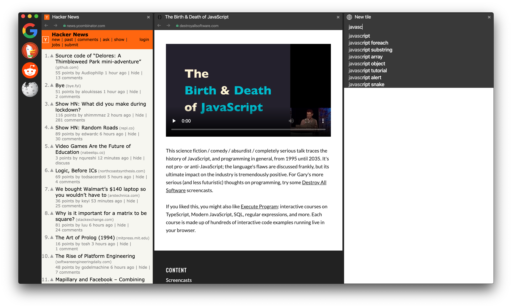

# Mosaic – A Tiling Web Browser

Web browser that can display multiple web pages at the same time in one shared window.

## Features

- [x] Documented [Design Decisions](DesignDecisions.md)
- [x] Pure Electron app, i.e. not based on Chromium
- [x] Intuitive drag&drop tile managment
- [x] Built-in search engine ([DDG](https://duckduckgo.com/))
    - auto suggest while typing
    - use [!bang](https://duckduckgo.com/bang) for advanced searches
- [x] Minimalistic look
- [x] Dock
- [x] Automatic zoom-to-fit
- [ ] Website thumbnail on tab hover and drag
- [ ] Familiar shortcuts (⌘T, ⌘W, ⌘L, ⌘←, ⌘→)
- [ ] Built-in privacy
    - [ ] Adblock ([uBlock Origin](https://github.com/gorhill/uBlock))
    - [ ] Blocking cookie consent non-sense
    - [x] No history
    - [ ] HTTPS everywhere
- [ ] [System keychain integration](https://github.com/atom/node-keytar)