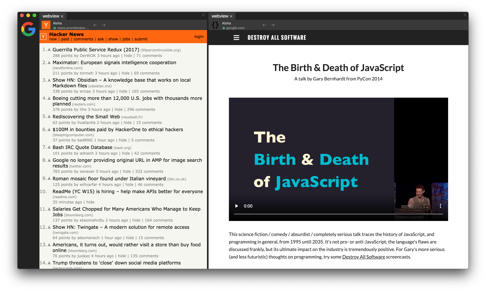

# Mosaic – A Tiling Web Browser

Web browser that can display multiple web pages at the same time in one shared window.

## Features

- [x] included [Design Decisions](DesignDecisions.md)
- [x] mouse-friendly tile managment
- [x] minimalistic look
- [x] new tile shortcut (⌘T)
- [x] create new tile by dragging launcher from the dock
- [ ] automatic zoom-to-fit
- [ ] built-in adblock
    - [ ] tooglable
- [ ] page preview in the drag proxy
- [ ] BUG: misplaced tile while and after dragging
    - repro: 1:1 layout, start dragging the right one
- [ ] tile persistance
    - well, I loose all my tiles when I do a refresh :(
- [ ] close tile shortcut (⌘W)
- [ ] back, forward shortcuts (⌘←, ⌘→)
- [ ] find on a page (⌘F)
    - I swear when it's missing
    - might focus URL bar with `[In Page]` pill in front of a blinking cursor and search icon somewhere near-by
- [ ] switch tiles by dragging
    - alt dragging one tile over the other and releasing, could rearrange tiles so that they will switch the places
    - scenario:
        1. I have screen with Reddit and Work shared as 1:2 (terrible idea, but the idea is you won't fall into uninterupted procrastination cycle if you'll keep disruptor present)
        2. 
- [ ] built-in HTTPS everywhere
- [ ] "no tiles" screen
- [ ] zen mode – temporary showing only single tile
- [ ] "+" button for new tab in the stack
- [ ] autosuggest while searching 
    - https://ac.duckduckgo.com/ac/?q={searchTerm}&type=list
- [ ] I don't care about cookies
    – every cookie consent bar is gone, *\*puff\**
- [ ] system keychain integration
    - I do not login much often in Mosaic so far, will have to wait
    - https://github.com/atom/node-keytar
- [ ] visual non-linear history
    - I want to see a high-level node-based visualization of my browsing history – it is going to be probably a let down.

## Inspiration
* https://www.behance.net/gallery/96719491/Cliqz-Browser-20-A-Better-Browsing-Experience?tracking_source=search_projects_recommended%7Cweb%20browser
* https://www.behance.net/gallery/5033195/Tabbed-Browser-History?tracking_source=search_projects_recommended%7Cweb%20browser
* https://twitter.com/everestpipkin/status/1261893242683109376
* http://iamweidan.com/project/visualization_WebHistory.html
* https://help.vivaldi.com/article/history/
* https://dothq.co/ – Looks like vaporware, but with a beautiful landing page.
* https://getstack.app/ – Polished card-based browsing

## Crazy ideas
- **Keeping history in Git** – Might have super interesting consequences.
- **Built-in web server** – Opera had built-in web server, which was über cool! Chrome has DevTools that are super powerful. Marrying the two might end up looking like this:
    1. I open new tile, pull up DevTools for that blank page. Edit source of it, e.g. add `<h1>Hello world</h1>` to it, push a toolbar button called "Live Share" and bam – I've got shareable URL that I can send to Steve. Steve opens it and see page with a header spelling "Hello world". Then I switch to DevTools and change word "world" to "Mosaic". Steve immediatelly see the change on his end.
    2. I'll add `<form><input /><button /></form>` and some action logic, and surprise, surprise Steve's hitting of a button will deliver the message "somehow" to me. Absolutely no idea how to do it.
    3. Already exists – https://beakerbrowser.com/
        - uses `hyper` P2P protocol, not HTTP, otherwise extra cool
- **Integrated BOINC** – Enabled by default without switch is bleh. Enabled with switch doesn't sound really nice. Maybe "share your CPU for Science" :D Not really. It is a bad idea.
- **Visual clipboard** – drag&drop into clipboard situated in a near-by panel. Should be great for researching stuff.
- **Social browsing** – you'll be able to interact with people visiting the same site in real-time.
- **Visual non-linear history** – history that can branch like a git repo, always preserved navigation metadata, i.e. answering questions like *"How did I get there?"*, *"What did I do there?"*.