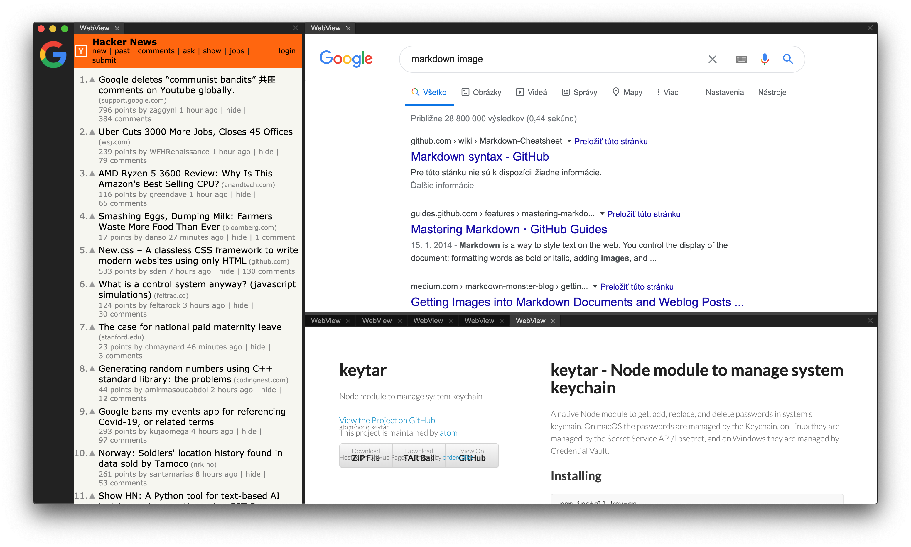

# Mosaic – Tiling Web Browser

A tiling web browser for the rest of us.

## Features

- [x] included [Architectural Design Decisions](ADD.md)
- [x] mouse-friendly tile managment
- [x] minimalistic look
- [x] new tile shortcut (⌘T)
- [ ] close tile shortcut (⌘W)
- [x] URL bar
    - [ ] polished
- [ ] page name and favicon in tile header
- [ ] switch tiles by dragging
- [ ] functional dock
- [ ] back, forward shortcuts (⌘←, ⌘→)
- [ ] system keychain integration
- [ ] automatic zoom-to-fit
- [ ] find on a page (⌘F)
- [ ] visual non-linear history
- [ ] tile persistance
- [ ] built-in adblock
- [ ] "no tiles" screen
- [ ] zen mode – temporary showing only single tile

## Inspiration
* https://www.behance.net/gallery/96719491/Cliqz-Browser-20-A-Better-Browsing-Experience?tracking_source=search_projects_recommended%7Cweb%20browser
* https://www.behance.net/gallery/5033195/Tabbed-Browser-History?tracking_source=search_projects_recommended%7Cweb%20browser
* https://twitter.com/everestpipkin/status/1261893242683109376
* http://iamweidan.com/project/visualization_WebHistory.html
* https://help.vivaldi.com/article/history/
* https://dothq.co/ – Looks like vaporware, but with a beautiful landing page.

## FAQ

- **Do you plan to have XY feature?**

    No.

## Crazy ideas
- **Visual clipboard** – drag&drop into clipboard situated in a near-by panel. Should be great for researching stuff.
- **Social browsing** – you'll be able to interact with people visiting the same site in real-time.
- **Visual non-linear history** – history that can branch like a git repo, always preserved navigation metadata, i.e. answering questions like *"How did I get there?"*, *"What did I do there?"*.